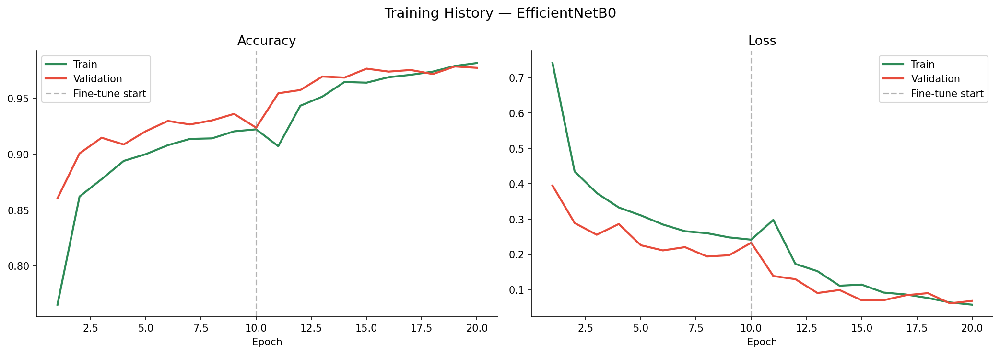
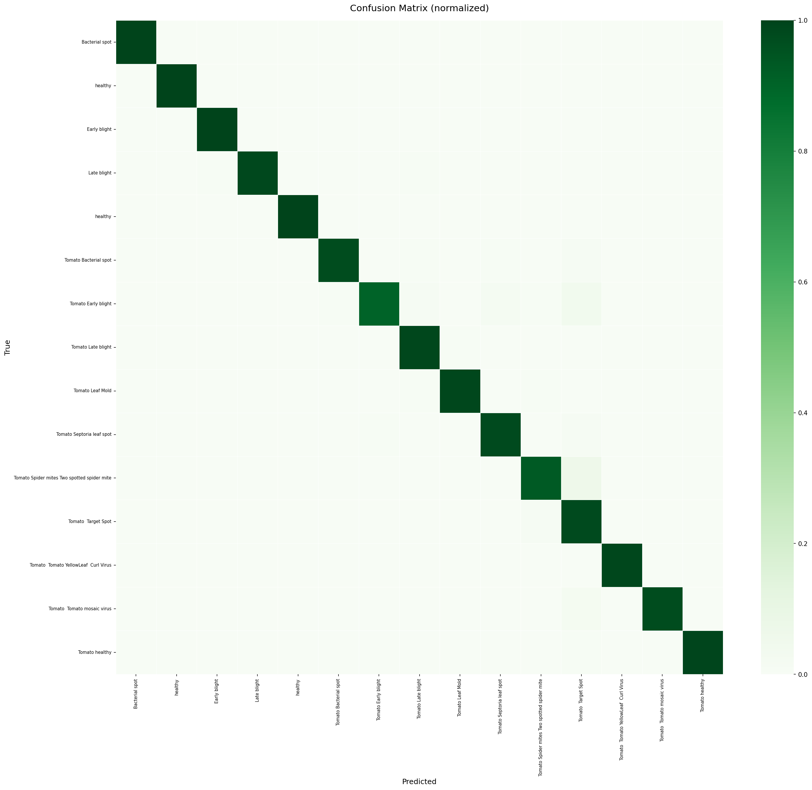
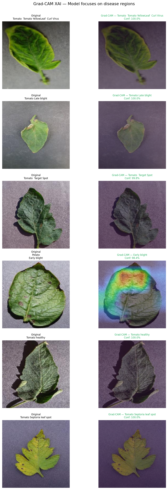

# 🌿 Plant Disease Detection

> Deep learning web application for automated plant disease detection using **EfficientNetB0** + **Transfer Learning**, with **Grad-CAM** explainability (XAI).


---

# Results

| Metric | Score |
|--------|-------|
| Validation Accuracy | **97.9%** |
| Top-3 Accuracy | **~99%** |
| Macro F1-Score | **0.980** |
| Macro Precision | **0.981** |
| Macro Recall | **0.979** |
| Classes | **15** |
| Training samples | **~16,500** |
| Validation samples | **4,122** |

---

## Project Structure

```
plant-disease-detection/
├── notebooks/
│   ├── Plant_Disease_Detection_Phase1.ipynb   ← Training + Evaluation + Grad-CAM
│   └── class_indices.json                     ← Class mapping (index → label)
├── assets/
│   ├── training_history.png                   ← Accuracy & loss curves
│   ├── confusion_matrix.png                   ← Normalized confusion matrix
│   ├── gradcam_visualization.png              ← Grad-CAM XAI visualizations
│   └── sample_images.png                      ← Dataset sample images
├── api/                                       ← Phase 2 (coming soon)
├── frontend/                                  ← Phase 3 (coming soon)
├── .gitignore
├── LICENSE
└── README.md
```

---

##  Model Architecture

```
Input (224×224×3)
    ↓
EfficientNetB0 (ImageNet pretrained, fine-tuned)
    ↓
GlobalAveragePooling2D
    ↓
BatchNormalization
    ↓
Dense(512, ReLU) + Dropout(0.4)
    ↓
Dense(256, ReLU) + Dropout(0.3)
    ↓
Dense(15, Softmax)
```

**Training strategy — 2 phases:**
- **Phase A** (10 epochs): Base frozen, only classification head trained — lr=1e-3
- **Phase B** (10 epochs): Last 30 layers unfrozen, fine-tuning — lr=1e-4

---

## Training History



The validation accuracy reaches **97.9%** after fine-tuning, with no signs of overfitting (train and validation curves stay close throughout).

---

## Confusion Matrix



Near-perfect diagonal — the model correctly classifies almost all 15 disease classes with minimal confusion between similar diseases.

---

## Grad-CAM XAI Visualization



**Grad-CAM** (Gradient-weighted Class Activation Mapping) highlights the regions of the leaf that the model uses to make its decision. Warm colors (red/yellow) indicate high attention zones — confirming the model focuses on actual disease symptoms rather than background.

---

## Dataset

**PlantVillage Dataset** — 15 classes of plant diseases and healthy leaves:

| Plant | Diseases |
|-------|----------|
| Pepper bell | Bacterial spot, Healthy |
| Potato | Early blight, Late blight, Healthy |
| Tomato | Bacterial spot, Early blight, Late blight, Leaf mold, Septoria leaf spot, Spider mites, Target spot, YellowLeaf Curl Virus, Mosaic virus, Healthy |

Source: [Kaggle — PlantVillage](https://www.kaggle.com/datasets/emmarex/plantdisease)

---

## Quickstart

### Run the notebook on Google Colab

[]([https://colab.research.google.com/github/useribtyssem/plant-disease-detection/notebooks/Plant_Disease_Detection_Phase1(1).ipynb)

1. Open the notebook in Colab
2. Enable GPU: `Runtime` → `Change runtime type` → `T4 GPU`
3. Upload your `kaggle.json` API token when prompted
4. Run all cells

### Local setup (coming with Phase 2)

```bash
git clone https://github.com/useribtyssem/plant-disease-detection.git
cd plant-disease-detection
pip install -r requirements.txt
```

---

## Roadmap

- [x] **Phase 1** — Dataset exploration, EfficientNetB0 training, Grad-CAM XAI
- [ ] **Phase 2** — FastAPI REST API + Docker + Swagger documentation
- [ ] **Phase 3** — React frontend + deployment on Hugging Face Spaces

---

## Tech Stack

| Category | Tools |
|----------|-------|
| Deep Learning | TensorFlow 2.15, Keras, EfficientNetB0 |
| XAI | Grad-CAM |
| Data Processing | NumPy, OpenCV, Scikit-learn |
| Visualization | Matplotlib, Seaborn |
| Environment | Google Colab, GPU T4 |
| Versioning | Git, GitHub |

---

## Author

**Ibtissem Ben Hamed** — Computer Science & Multimedia, AI/ML Engineer  
📧 ibtissembenhamed00@gmail.com  
🔗 [LinkedIn](https://linkedin.com/in/ibtissem-benhamed)

---

## License

This project is licensed under the MIT License — see the [LICENSE](LICENSE) file for details.
